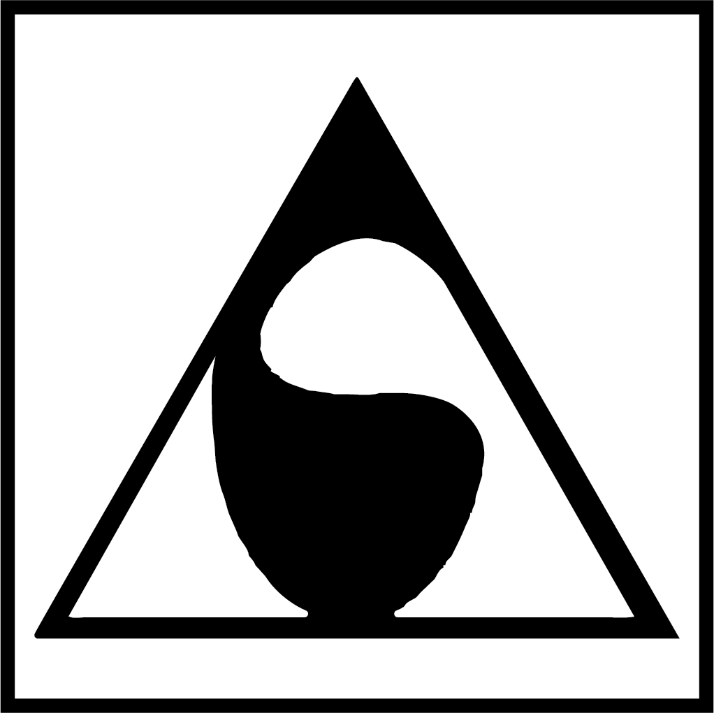

> <b>Life is a succession of lessons, which must be lived to be understood.</b>
>  — <cite>Ralph Waldo Emerson</cite>

<!--  -->

# 👋 Hey there! My name is Amir.

## Table of Contents
1. [Little to know about me](#little-to-know-about-me)
2. [My Skillset](#my-skillset)
3. [Stats](#stats)
4. [Motivational Poem](#motivational-poem)
5. [More to know about me](#more-to-know-about-me) <em>(Read it at your own risk)</em>

## Little to know about me
- 💻 I finished a CS program at Seneca College.
- 📊 Left my learnings after graduation and became a Marketing Technologist for a year.
- 👨🏻‍💻 Loved it, but loved programming more.
- 🚀 Kicked off my development journey again.
- 🌐 More focused on front-end development this time.
- 🌱 Currently pursuing a Front-End Dev Career Path at [Scrimba](https://scrimba.com). 

- 📫 How to reach me: 📧[Email](mailto:info@arsenicolos.com) | 🌏[Website](https://arsenicolos.com) |  
- 🤔 I share a favorite poems of mine called [*Don't Quit*](#motivational-poem) after the Stats section.
---
## My Skillset
<em>(If needed, you can hover on the image for its name)</em>
### Front-End Development
      
<b style="font-size:1.1em;height:">Learning: </b>   

### Back-End Development
      

### Programming Languages
   
<em> (My knowledge of these languages is outdated at the moment)</em>

### Nice To Mention
         

---

## Stats

  

  
  

 [Credit](https://github.com/ryo-ma/github-profile-trophy)
  

 [Credit](https://github.com/anuraghazra/github-readme-stats)
  
---

## Motivational Poem

  

Open Dropdown

 

***Don't Quit!***
 
<cite>by: *Edgar Albert Guest*</cite>
  
> “When things go wrong, as they sometimes will, 
> When the road you’re trudging seems all uphill, 
> When the funds are low and the debts are high, 
> And you want to smile, but you have to sigh, 
> When care is pressing you down a bit, 
> Rest, if you must, but don’t you quit. 
> 
> Life is queer with its twists and turns, 
> As every one of us sometimes learns, 
> And many a failure turns about, 
> When he might have won had he stuck it out; 
> Don’t give up though the pace seems slow- 
> You may succeed with another blow. 
> 
> Often the goal is nearer than, 
> It seems to a faint and faltering man, 
> Often the struggler has given up, 
> When he might have captured the victor’s cup, 
> And he learned too late when the night slipped down, 
> How close he was to the golden crown. 
> 
> Success is failure turned inside out- 
> The silver tint of the clouds of doubt, 
> And you never can tell how close you are, 
> It may be near when it seems so far, 
> So stick to the fight when you’re hardest hit- 
> It’s when things seem worst that you must not quit” 
  

---

## More to know about me
<b> ⚠️Warning: Reading the below information is absolutely unnecessary and does you no benefit than knowing me better. Please proceed at your own risk. </b>

  

Open Dropdown

  
- 🎙️ Podcasts I highly support:
    - The Joe Rogan Experience
    - Lex Fridman Podcast
    - Huberman Lab
    - Modern Wisdom
    - The Game w/ Alex Hormozi
    - The School of Greatness
    - Masters of Scale
- 📙 Currently Reading:
    - Sell Like Crazy
    - Kafka on the Shore
    - ([Add me as a friend on Goodreads](https://www.goodreads.com/user/show/93210875-amir))
- 🎥 Currently watching:
    - Twin peaks
    - Whiplash
    - ([Add me as a friend on Letterboxd](https://letterboxd.com/Arsenicolos/))
- 💬 Favorite topics to chat over coffee:
    - Blockchain
    - Food
    - History & Philosophy
    - Mindfulness
    - Business & Startup
- ⚡ Fun facts:
    - I'm left-handed
    - My curiosity is the easiest to trigger 
    - I'm a novice cyclist🚴‍♂️ and boxer🥊
    - Used to play basketball🏀 and table tennis🏓 professionally <em>(still can beat your ass on the latter)</em>
    - My memory is shorter than that of a fish🐟
    - I'm super attentive to detail <em>(not so fun at times)</em> 

<!--  -->

